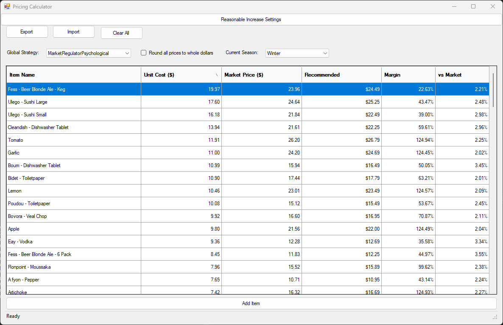
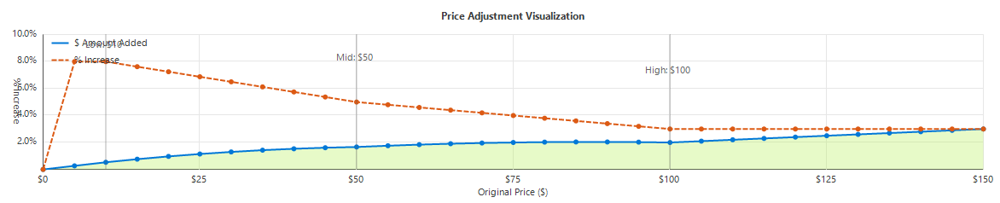
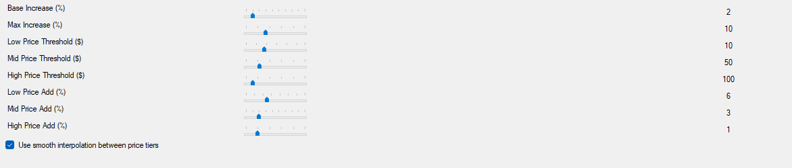

# PricingCalculator

A sophisticated retail pricing management application built with C# and .NET that enables dynamic price calculation based on multiple pricing strategies and business rules.



## Features

- **Modular Pricing Engine**: Flexible calculation system based on operations with different priorities
- **Multiple Pricing Strategies**: 40+ pre-configured pricing strategies from conservative to aggressive
- **Priority-Based Operations**: Organized workflow for applying pricing operations in the correct sequence
- **Seasonal Adjustments**: Automatic detection and application of seasonal pricing factors
- **Reasonable Increase Configuration**: Fine-tuned price increases based on price tiers with visual graph
- **Margin Protection**: Built-in minimum margin calculation to protect profitability
- **User-Friendly Interface**: Clean Windows Forms UI with grid view for managing product pricing
- **Import/Export Support**: Save and load pricing data through JSON serialization
- **Visual Price Mapping**: Graph visualization of pricing curves for better decision making

## Technical Details

- **Framework**: .NET Framework 4.5+
- **Language**: C# (.NET)
- **UI**: Windows Forms
- **Dependencies**: Newtonsoft.Json for serialization
- **Design Patterns**: 
  - Flag-based operation system using C# Enums
  - Strategy pattern for implementing different pricing algorithms
  - Factory pattern for operation creation
  - Observer pattern for UI updates

## How It Works

The application uses a series of configurable operations (multiply, add, min, max, etc.) that are applied to product prices in a specific sequence determined by operation priority. Each pricing strategy is a combination of flags that determine which operations are applied and in what order.

Operations are organized into priority levels:
1. Basic price adjustments (discounts, increases)
2. Minimum viable price checks
3. Margin multipliers
4. Competitive pricing adjustments
5. Premium image offsets
6. Seasonal adjustments
7. Bundle pricing rules
8. Key price point targeting
9. Floor price application
10. Cent adjustments for psychological pricing
11. Ceiling price application

## Screenshots

### Main Interface


### Price Graph Visualization


### Strategy Configuration


## Getting Started

### Prerequisites
- Windows 7 or later
- .NET Framework 4.5 or later
- Visual Studio 2015 or later (for development)

### Installation
1. Clone the repository
   ```
   git clone https://github.com/Novocain1/PricingCalculator.git
   ```
2. Open the solution in Visual Studio
   ```
   cd PricingCalculator
   start PricingCalculator.sln
   ```
3. Build the solution
   ```
   msbuild PricingCalculator.sln
   ```

### Usage
1. Launch the application
2. Add products with their unit costs and market prices
3. Select a global pricing strategy
4. Adjust seasonal settings if needed
5. Review recommended prices and margins
6. Export your pricing data or save for later use

## Example Pricing Strategies

| Strategy | Description | Use Case |
|----------|-------------|----------|
| Balanced | Modest 2% discount with minimum viability check | General purpose |
| Aggressive | 5% discount with minimum viability check | Competitive markets |
| Premium | 10% increase with minimum viability check | High-end products |
| Psychological99 | 2% discount with floor price + 99 cents | Retail consumer goods |
| MarketEntry | 10% discount with maximum penetration | New product launch |
| EliteStatus | 15% increase with premium image | Luxury offerings |
| BlackFriday | 10% discount with floor price + 99 cents | Holiday promotions |

## Contributing

Contributions are welcome! Please feel free to submit a Pull Request.

1. Fork the repository
2. Create your feature branch (`git checkout -b feature/amazing-feature`)
3. Commit your changes (`git commit -m 'Add some amazing feature'`)
4. Push to the branch (`git push origin feature/amazing-feature`)
5. Open a Pull Request

## License

This project is licensed under the MIT License - see the [LICENSE](LICENSE) file for details.

## Acknowledgments

- Special thanks to all contributors who have helped shape this project
- Claude, an AI assistant from Anthropic, was used as a development tool to help design, refine, and document this application
- Inspired by retail pricing best practices and industry standards
